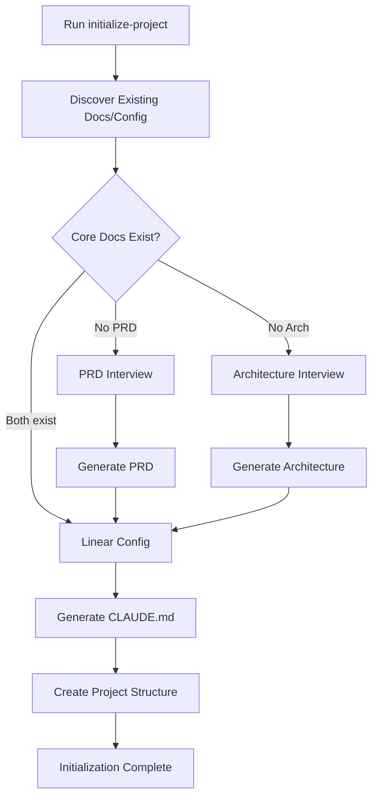

# Initialize Project Command

## Purpose
Intelligently initialize a project for TDD workflow by discovering existing documentation, guiding creation of missing pieces, and generating a tailored CLAUDE.md.

## Usage
```
initialize-project
```

This command will:
1. **Discover** - Analyze existing project structure and documentation
2. **Interview** - Guide creation of missing core documentation
3. **Generate** - Create customized CLAUDE.md and project structure

## Phase 1: Discovery

### Check for Existing Documentation
```bash
# Look for these files
docs/prd.md or docs/PRD.md or PRD.md
docs/architecture.md or docs/ARCHITECTURE.md or ARCHITECTURE.md
CONTRIBUTING.md or docs/CONTRIBUTING.md
README.md
CLAUDE.md
```

### Detect Technology Stack
```bash
# Language detection files (in priority order)
package.json → Node.js/JavaScript/TypeScript
requirements.txt or setup.py or Pipfile → Python
go.mod or go.sum → Go
pom.xml or build.gradle → Java
Cargo.toml → Rust
*.csproj or *.sln → C#/.NET
Gemfile → Ruby
mix.exs → Elixir
composer.json → PHP
```

### Detect Test Framework
```bash
# Based on dependencies or config files
jest.config.* → Jest
pytest.ini or tox.ini → Pytest
*_test.go files → Go test
src/test/java → JUnit/TestNG
mocha.opts → Mocha
karma.conf.* → Karma
```

### Detect Build System
```bash
# Build configuration files
webpack.config.* → Webpack
vite.config.* → Vite
tsconfig.json → TypeScript
Makefile → Make
CMakeLists.txt → CMake
```

## Phase 2: Interview Process

### If PRD Missing - Product Requirements Interview

```markdown
## Product Requirements Document Interview

I'll help you create a Product Requirements Document. Please answer these questions:

### 1. Product Overview
**What is the name of your product/project?**
> 

**What problem does it solve? (1-2 sentences)**
> 

**Who are the target users?**
> 

### 2. Core Features
**List the 3-5 main features/capabilities:**
1. 
2. 
3. 
4. 
5. 

### 3. User Stories
**Describe 2-3 key user journeys:**

As a [user type], I want to [action] so that [benefit]
> 

As a [user type], I want to [action] so that [benefit]
> 

### 4. Success Metrics
**How will you measure success?**
- 
- 
- 

### 5. Constraints & Requirements
**Any specific constraints? (technical, business, regulatory)**
> 

**Performance requirements?**
> 

**Security/compliance requirements?**
> 

### 6. MVP Scope
**What's the minimum viable product?**
> 

**What's explicitly out of scope for v1?**
> 
```

### If Architecture Missing - Architecture Interview

```markdown
## Architecture Document Interview

I'll help you create an Architecture Document. Please answer these questions:

### 1. System Overview
**Describe the system in one paragraph:**
> 

**What architectural style/pattern? (monolith, microservices, serverless, etc.)**
> 

### 2. Technology Choices
**Primary programming language:**
> 

**Framework (if any):**
> 

**Database/storage:**
> 

**External services/APIs:**
> 

### 3. System Components
**List main components/modules:**
1. 
2. 
3. 

**How do they interact?**
> 

### 4. Data Flow
**How does data flow through the system?**
> 

**What are the main data models/entities?**
> 

### 5. Non-Functional Requirements
**Performance targets:**
- Response time: 
- Throughput: 
- Concurrent users: 

**Availability target:**
> 

**Scalability approach:**
> 

### 6. Security
**Authentication method:**
> 

**Authorization approach:**
> 

**Data protection:**
> 

### 7. Infrastructure
**Deployment target: (cloud/on-prem/hybrid)**
> 

**CI/CD approach:**
> 

**Monitoring/observability:**
> 
```

### Linear Integration Interview

```markdown
## Linear Configuration

### Do you use Linear for issue tracking? (yes/no)
> 

If yes:
**Team name in Linear:**
> 

**Project name in Linear:**
> 

**Would you like me to fetch the IDs using Linear MCP?** (yes/no)
> 

If no IDs fetched:
**Team ID (if known):**
> 

**Project ID (if known):**
> 
```

## Phase 3: Document Generation

### Generate PRD from Interview
```markdown
# Product Requirements Document

## Executive Summary
{{Synthesized from product overview and problem statement}}

## Problem Statement
{{From interview answer}}

## Target Users
{{From interview answer}}

### User Personas
{{Expand on target users}}

## Core Features

### Feature 1: {{Name}}
**Description**: {{Derived from feature list}}
**User Story**: {{From user stories}}
**Acceptance Criteria**:
- {{Generated based on feature}}

[Continue for each feature...]

## Success Metrics
{{From interview answers}}

## Constraints
### Technical Constraints
{{From constraints answer}}

### Business Constraints
{{Derived from context}}

## MVP Definition
### In Scope
{{From MVP scope}}

### Out of Scope
{{From out of scope answer}}

## Timeline
{{To be determined}}

## Risks and Mitigations
{{Analyze from constraints and requirements}}
```

### Generate Architecture from Interview
```markdown
# Architecture Document

## System Overview
{{From system overview answer}}

## Architectural Decisions

### Architectural Style
**Pattern**: {{From architectural style}}
**Rationale**: {{Infer from context}}

### Technology Stack
- **Language**: {{From language answer}}
- **Framework**: {{From framework answer}}
- **Database**: {{From database answer}}
- **External Services**: {{From services answer}}

## System Architecture

### Component Diagram
```mermaid
graph TB
    {{Generate based on components}}
```

### Components
{{For each component from interview}}
#### {{Component Name}}
- **Responsibility**: {{Inferred}}
- **Technology**: {{From stack}}
- **Interfaces**: {{Derived}}

## Data Architecture

### Data Flow
{{From data flow answer}}

### Data Models
{{From data models answer}}

## Non-Functional Requirements

### Performance
{{From performance targets}}

### Availability
{{From availability target}}

### Scalability
{{From scalability approach}}

### Security
- **Authentication**: {{From auth method}}
- **Authorization**: {{From auth approach}}
- **Data Protection**: {{From data protection}}

## Infrastructure

### Deployment Architecture
{{From deployment target}}

### CI/CD Pipeline
{{From CI/CD approach}}

### Monitoring
{{From monitoring approach}}

## Risks and Mitigations
{{Analyze from requirements}}
```

### Generate Tailored CLAUDE.md

Based on discovered and interviewed information, generate CLAUDE.md with:

```markdown
# CLAUDE.md - Project Configuration

## Project Overview
**Name**: {{From PRD}}
**Description**: {{From PRD}}
**Repository**: {{From git remote}}

## Technology Stack
{{Detected or provided}}
- **Language**: {{detected}}
- **Framework**: {{detected}}
- **Testing**: {{detected}}
- **Build System**: {{detected}}

## Documentation References
{{Only include what exists}}
- **Architecture**: @docs/architecture.md
- **Product Requirements**: @docs/prd.md
- **Development Standards**: @CONTRIBUTING.md

## TDD Workflow Configuration
### Agents
- **Coordinator**: @.claude/agents/coordinator.md
- **QA**: @.claude/agents/qa.md
- **Developer**: @.claude/agents/developer.md
- **Architect**: @.claude/agents/architect.md
- **Code Reviewer**: @.claude/agents/code-reviewer.md

### Commands
- **Initialize Project**: @.claude/commands/initialize-project.md
- **Create Epic**: @.claude/commands/create-epic.md
- **Create Story**: @.claude/commands/create-story.md
- **Create Subtasks**: @.claude/commands/create-subtasks.md
- **Check Overlap**: @.claude/commands/check-overlap.md
- **Fetch Context**: @.claude/commands/fetch-context.md

{{If Linear configured}}
## Linear Integration
- **Team**: {{team_name}} (`{{team_id}}`)
- **Project**: {{project_name}} (`{{project_id}}`)

## Development Configuration

### Testing
{{Based on detected test framework}}
```bash
# Run tests
{{Actual command based on detection}}

# Run with coverage
{{Actual command based on detection}}
```

### Build Commands
{{Based on detected build system}}
```bash
# Development
{{Actual command}}

# Production
{{Actual command}}
```

### Code Quality
{{Based on detected tools}}
```bash
# Lint
{{If linter detected}}

# Type check
{{If type checker detected}}
```

## Definition of Done
{{Generate based on project type and stack}}

### For {{Language}} Projects
- [ ] All tests passing
- [ ] Code reviewed
- [ ] {{Language-specific checks}}
- [ ] Documentation updated
- [ ] No security vulnerabilities

## Project Structure
{{Show actual structure discovered}}
```

## Phase 4: Project Structure Creation

### Create Missing Directories
```bash
# Only create if they don't exist
mkdir -p docs/design/epics
mkdir -p docs/design/stories
mkdir -p docs/adr
mkdir -p tests
mkdir -p src
mkdir -p scripts
mkdir -p config
```

### Generate .gitignore
After detecting the technology stack from architecture document:
- Analyze the chosen language, framework, and tools
- Generate appropriate .gitignore patterns
- Include common patterns (OS files, IDE files, .env)
- Add language-specific patterns:
  - Node.js → node_modules, dist, build, .next
  - Python → __pycache__, venv, *.pyc, .pytest_cache
  - Go → vendor, *.exe, go.sum
  - Java → target, *.class, *.jar
  - Rust → target, Cargo.lock
  - C# → bin, obj, *.suo
- Add framework-specific patterns
- Add tool-specific patterns (Docker, Terraform, etc.)

## Execution Flow



## Interactive Example Session

```
Human: initialize-project

Claude: I'll help initialize your project for TDD workflow. Let me first check what already exists...

🔍 Discovery Phase:
- ✅ Found: package.json (Node.js project)
- ✅ Found: jest.config.js (Jest testing)
- ✅ Found: README.md
- ❌ Missing: Product Requirements Document
- ❌ Missing: Architecture Document
- ❌ Missing: CLAUDE.md

I need to gather some information to create the missing documentation.

📝 Product Requirements Interview:

**What is the name of your product/project?**