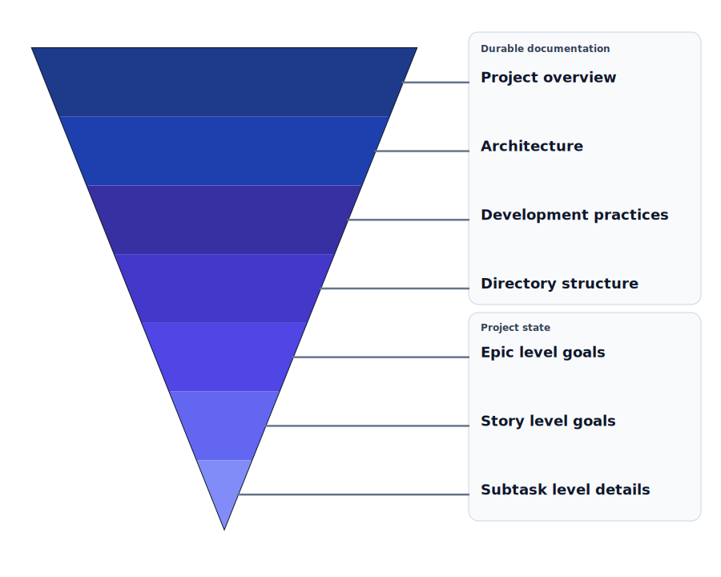
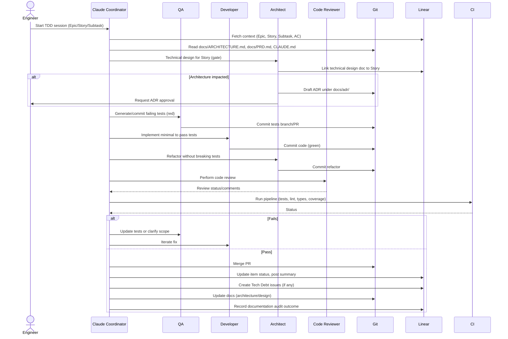

# John's Claude von Repo

## Multi-Agent Test Driven Development Workflow

Maximize the length of your Claude Code sessions without trading off quality.

-----------------------------------------------------------

## Table of Contents

- [Why?](#why)
- [Managing Context](#managing-context)
- [Requirements](#requirements)
- [System Design Baseline (pre-backlog)](#system-design-baseline-pre-backlog)
- [Feature Technical Design Docs (per Story)](#feature-technical-design-docs-per-story)
- [Architecture Change Control (ADRs)](#architecture-change-control-adrs)
- [End-of-cycle hygiene](#end-of-cycle-hygiene)
- [Roles](#roles)
- [Orchestrated TDD Overview](#orchestrated-tddv-overview)
- [Detailed Steps](#detailed-steps)
- [Prompt Templates](#prompt-templates)
  - [Coordinator (parent process)](#coordinator-parent-process)
  - [QA agent](#qa-agent)
  - [Developer agent](#developer-agent)
  - [Architect agent](#architect-agent)
  - [Code Reviewer agent](#code-reviewer-agent)
- [Linear + CLAUDE.md Conventions](#linear--claudemd-conventions)
- [Working Agreement and Anti-Patterns](#working-agreement-and-anti-patterns)
- [Quick Checklist](#quick-checklist)
- [Appendix: Example .claude/agents layout](#appendix-example-claudeagents-layout)
- [Alternatives: Tools that can support this workflow](#alternatives-tools-that-can-support-this-workflow)
  - [Coordinator/Subagent Orchestrators](#coordinatorsubagent-orchestrators)
  - [References](#references)

## Why?

Set up your project to run a practical, collaborative, AI‑assisted TDD workflow that:

- Improves consistency, speed, and quality
- Preserves cross‑team context on large projects
- Balances individual autonomy with aligned interfaces, checkpoints, and outputs
- Onboards new engineers quickly via predictable roles and artifacts

This flow assumes Claude Code with multiple role agents, plus Linear MCP for contextual story data.

### TDD works well with Agentic development!

Agentic flows break work into explicit phases with clear handoffs. TDD naturally provides those gates:

- Tests encode acceptance criteria, enabling unambiguous contracts between agents.
- Red→Green→Refactor creates short, verifiable cycles that agents can iterate safely.
- Artifacts (tests, diffs, CI results) give objective feedback that coordinators can use to decide the next step.
- Role specialization maps cleanly: QA writes contracts (tests), Developer satisfies them, Architect improves design and enforces standards.
- Validation ensures autonomy stays bounded: agents can propose changes, but merges are gated by tests and Definition of Done.

Net effect: faster feedback, fewer regressions, and auditable progress.

### Pros

- The context window of the orchestrator _feels_ significantly extended given they are only coordinating the work
- Decreased risk of hallucinations going unnoticed until the PR is opened (when it is the most expensive to fix). Most often, confabulations are caught in the REFACTOR or VALIDATION steps, which means they are less likely to make it to the PR.
- Smaller, safer diffs and PRs; reviews are faster and rollbacks are simpler.
- Better parallelism: QA can prep tests while Dev/Arch finish prior items.
- Stronger knowledge capture in tests and issues; reduces context rot between sessions.
- Measurable gates (AC, CI, DoD) make progress and quality visible.
- Easier to pause/resume work; artifacts preserve state across agent runs.

### Cons

- Expensive! The overhead of having multiple agents injest the same context means we're burning through tokens as if they grew on trees.
- Coordination overhead and phase handoffs can also elongate calendar time.
- Brittle or over-specified tests can block progress and obscure intent.
- Risk of ping-ponging between roles when AC is ambiguous or incomplete.
- Not ideal for trivial changes; ceremony can outweigh benefits.

-----------------------------------------------------------

## Managing Context

Providing the correct amount of context for an agent to perform tasks reliably requires working with their constraints and limitations. If a prompt isn't specific enough we risk having the model fill in the blanks rather "creatively" but if the prompt is too large then [context rot](https://lego17440.medium.com/context-rot-the-hidden-vulnerability-in-ais-long-memory-afde1522c0c8) can begin to seep in. This is further exacerbated with longer sessions.


**Agents need to be provided with _just the right amount_ of information.**

 Information must be structured in a manner that allows for re-usability and shifting our focus as we progress through TDD loops.

One approach which seems to work well is to include links to the high-level, durable documentation in the agents' markdown definition and relevant Linear issues in prompts. Information that isn't task specific should be included in higher-level documents while task specific context is included in Linear.

This allows us to move from task to task providing only relevant information.

### Documentation Hierarchy

1. **Broader, Durable documentation in the repo**
  - What is the project about? (`README.md`)
  - How does the system work? (`docs/ARCHITECTURE.md`)
  - How is the project structured? (`docs/STRUCTURE.md`)
  - What development standards to we follow? (`CONTRIBUTING.md`)

2. **Narrower, Task oriented, Project state details in Linear**
  - Epic-level body of work that spans multiple teams and sprints
  - Story-level specific work that can be completed by a single team during a sprint
  - Acceptance Criteria for the work
  - Stories can be broken down into Subtasks
  - Subtasks provide the most granular level of detail about work that can be accomplished by a single team during a sprint

With the information structured in this way, Agents can be given a single Story and be asked to examine it's parent Epic and it's Subtasks to get a complete picture of the task(s) at hand.

### Levels of Granularity (coarsest -> finest)



[Back to Table of Contents](#table-of-contents)

-----------------------------------------------------------

## Requirements

### 0. Claude Code, well duh.

While the concepts covered here should be easily trasferable to other tools such as Cursor, Warp, Codex and others, we will be focusing on Claude Code. If you haven't yet, please install CC by running:

```shell
$ brew install --cask claude-code
```

### 1. Great AI-friendly documentation

Markdown is the ideal format for this. [Agents](https://docs.anthropic.com/en/docs/claude-code/sub-agents) need to be able to understand the project, how it's structured, what patterns, conventions and development practices to follow. This is information that changes infrequently and should be _mostly_ static throughout the life of the project.  Mermaid diagrams are particularly useful given they can be viewed by humans and interpreted easily by agents as well.

- `README.md`:

    High-level description of the project, it's features, with the usual links to other documents.

- `docs/prd.md`:

    An overview, defining the project's purpose and goals; context, detailing target users, personas, and competitive landscapes; features and requirements, which list specific functionalities with user stories and acceptance criteria; designs, sketches, and mockups to guide development; and success metrics, to measure the product's achievement.

- `docs/architecture.md`:

    High-level goals, functional and non-functional requirements, system context, architectural views (logical, implementation, deployment), data flow and integration details, technology choices, and security considerations.

- `CONTRIBUTING.md`:

    This is great for both humans and agents! Contains setup instructions, build commands, branching logic, code style and guidelines, test setup, execuition and coverage expectations as well as pull request / release instructions.

### 2. A comprehensive `CLAUDE.md` setup

- Contains project context that is applicable to all Agents, including the Coordinator (parent) agent
- Conversely does NOT include details that are specific to a single agent
- Includes `@` links to high-level, durable Markdown documentation stored in the project's repo. For example:
    - `README.md`
    - `docs/architecture.md`
    - `docs/prd.md`
    - `CONTRIBUTING.md`
    - \<_add other docs as needed_\>
- Includes team and project defaults for locating Linear issues
- Example `CLAUDE.md`:
    ```md
    ### Project overview:
    @README.md

    ### Architecture:
    @docs/architecture.md

    ### Product Requirements Document:
    @docs/prd.md

    ### Development Standards
    @CONTRIBUTING.md

    ## Linear References

    We use the Epic -> Story -> Subtask hierarchy. When given a Linear ID, please check the parent issues recursively for additional context.

    ### Team & Project IDs

    - **Team**: Foundations - `03ee7cf5-773e-4f53-bc0d-2e5e4d3bc3bc`
    - **Project**: Encounter Processor - `217eeb45-4f83-4ca0-8030-81f9c78692bc`

    ### Issue Status IDs

    - **Backlog**: `1e7bd879-6685-4d94-8887-b7709b3ae6e8` (type: backlog)
    - **Todo**: `fc814d1f-22b5-4ce6-8b40-87c1312d54ba` (type: unstarted)
    - **In Progress**: `a433a32b-b815-4e11-af23-a74cb09606aa` (type: started)
    - **In Review**: `8d617a10-15f3-4e26-ad28-3653215c2f25` (type: started)
    - **Done**: `3d267fcf-15c0-4f3a-8725-2f1dd717e9e8` (type: completed)
    - **Canceled**: `a2581462-7e43-4edb-a13a-023a2f4a6b1e` (type: canceled)
    - **Duplicate**: `3f7c4359-7560-4bd9-93b7-9900671742aa` (type: canceled)

    ```

### 3. Highly Specialized TDD Agents
- Define each agent’s instruction set and guardrails under `.claude/agents/`
    - `qa.md` (writes/updates tests)
    - `developer.md` (implements)
    - `architect.md` (refactors)
    - `code-reviewer.md` (reviews and proposes changes)

### 4. Linear MCP installed and configured
  - One first start, the Linear MCP tool will require auth
  - Ask Claude Code to find the ids for the team, project and status values:

    > \> please query Linear for the IDs of the "Foundations Engineering" team and "Encounter Processor" project and update @CLAUDE.md with those details, along with a map of labels to IDs of the issues statuses (Todo, Done, In Review, etc)

### 5. A Coherently Broken-down Backlog in Linear
  - Use progressive context: Epic → Story → Subtask. Each child references only what it needs from its parent and adds the next layer of specificity.
  - Avoid overlap: do not restate parent details verbatim; link to them and extend. Prefer references (IDs, links) over copy/paste.
  - Write issues so downstream role agents (QA, Developer, Architect) can execute with just-in-time context.

  - Epic (broad intent and constraints):
    - Outcome and scope boundaries; business value; success metrics.
    - Non-functional constraints (security, performance, SLOs) and global assumptions.
    - Dependencies and risks; links to durable docs (`CLAUDE.md`, `docs/architecture.md`, `docs/prd.md`).
    - Do **not** include implementation steps; propose 3–6 one-line Story intents.

  - Story (single-sprint, testable outcome):
    - References its Epic by ID and cites only the constraints it actually uses.
    - Clear user story and rationale; explicit acceptance criteria (AC) that map to tests.
    - Interfaces/contracts to touch; data/edge cases; handoffs.
    - Leaves concrete steps to Subtasks; keeps scope tight enough for one PR.

  - Subtask (atomic, executable unit):
    - References its Story; adds precise deliverables: files to change, endpoints, configs, migrations, and test names to create.
    - Acceptance checks as a checklist; single owner; finishable within hours.
    - Mentions artifacts to produce (PR with labels, tests, doc updates) rather than repeating Story context.

  - Example prompts to generate high-quality backlog items with minimal overlap:

    - Epic prompt

    ```text
    You are drafting a Linear Epic for {{project_name}}.

    Output fields:
    - Title (concise, outcome-oriented)
    - Summary (≤5 sentences)
    - Outcomes & success metrics (measurable)
    - In scope / Out of scope
    - Non-functional constraints (security, performance, SLOs)
    - Dependencies & risks
    - Links to durable docs: @CLAUDE.md, @docs/ARCHITECTURE.md, @docs/PRD.md
    - Definition of Done (cross-epic gates)
    - Proposed Story intents (3–6 bullets; one line each; no steps)

    Rules:
    - Do not include implementation steps or team assignments.
    - Prefer references/links over restating details.
    - Keep context that children can inherit without duplication.
    ```

    - Story prompt (given an Epic)

    ```text
    Draft a Linear Story for Epic {{epic_id}} ("{{epic_title}}").

    Output fields:
    - Title (single-sprint, testable outcome)
    - User story (As a … I want … so that …)
    - Rationale (why this Story exists under the Epic)
    - Acceptance Criteria (numbered; each verifiable via tests)
    - Interfaces/contracts this Story touches
    - Edge cases & data considerations
    - Dependencies (reference IDs, do not restate Epic)
    - Links to Epic and relevant docs (IDs/anchors only)
    - Out of scope (to prevent bleed)
    - Validation signals (what QA/CI should verify)

    Rules:
    - Reference the Epic for context; do not copy its text.
    - Keep scope tight enough for one small PR.
    - Leave execution steps to Subtasks.
    ```

    - Subtask prompt (given a Story)

    ```text
    Create atomic Subtasks for Story {{story_id}} ("{{story_title}}") that a single engineer can finish in hours.

    For each Subtask, output:
    - Title (verb-led, concrete)
    - Description (what to change/build; include file paths, endpoints, configs)
    - Deliverables (artifacts: PR with labels, tests added, docs updated)
    - Acceptance checks (checkbox list; objective)
    - Links (reference {{story_id}} and any related IDs)
    - Test hooks (names/locations of unit/integration tests to add)

    Rules:
    - Do not repeat Story context; link to it.
    - Avoid multi-step subtasks; split when in doubt.
    - Prefer explicit artifacts over vague outcomes.
    ```

  - Overlap guardrail prompt (run after drafting):

    ```text
    Review Epic {{epic_id}}, its Stories, and Subtasks for duplication.
    - Identify any repeated sentences/criteria across levels.
    - Rewrite children to reference parents instead of repeating text.
    - Ensure each Acceptance Criterion is asserted exactly once at the lowest appropriate level.
    Return the revised items.
    ```


[Back to Table of Contents](#table-of-contents)

## System Design Baseline (pre-backlog)

Establish and review a comprehensive system design before populating the backlog. This reduces rework and aligns stories with stable boundaries.

- System context and architecture views are documented in `docs/architecture.md` (logical, deployment, data, integration)
- Domain model, key workflows, and invariants are captured (sequence/state diagrams encouraged)
- External integrations and SLAs, schemas, and versioning strategy are defined
- Non-functional requirements (security, privacy, performance, availability, observability) are explicit
- Capacity assumptions and rough sizing are noted (orders of magnitude are sufficient)
- Known risks and decision tradeoffs recorded; ADR index initialized (see Architecture Change Control)
- Human review/approval recorded before moving to backlog creation

Quick baseline checklist:

- Architecture views present and linked from `CLAUDE.md`
- Interfaces and data contracts sketched with versioning plan
- NFRs enumerated and testable where feasible
- ADR directory created with initial records (if applicable)

[Back to Table of Contents](#table-of-contents)

## Feature Technical Design Docs (per Story)

Every Story should have a short technical design document that is reviewed and approved before coding starts. Keep it concise (1–2 pages) and link artifacts.

Required contents (minimum):

- Problem statement and scope boundaries; link the parent Epic/Story in Linear
- Proposed approach and alternatives considered; rationale
- Affected components/interfaces, data models, migrations, and risks
- Test strategy mapping AC → tests; rollout/rollback considerations
- Impact on architecture? If yes, reference/introduce an ADR (see below)

When to design:

- Up-front (during Story creation):
  - Pros: Better dependency planning, smoother parallelization, earlier risk surfacing
  - Cons: Risk of churn if requirements evolve; higher upfront time cost
- Just-in-time (first step before development):
  - Pros: Fresher context, less waste if scope changes, aligns closely with implementation
  - Cons: Can compress schedules; risks late discovery of cross-team impacts

Recommended approach for this workflow: a hybrid.

- Create a lightweight design stub at Story creation (problem, options, initial interfaces)
- Flesh it out just-in-time before QA writes tests so AC and tests reflect the final design
- Require human approval of the design doc before moving to Red (tests)

Template: [docs/design/story-design-template.md](docs/design/story-design-template.md)

[Back to Table of Contents](#table-of-contents)

## Architecture Change Control (ADRs)

Any change that affects cross-cutting concerns or system boundaries must be captured via an Architecture Decision Record and explicitly called out for human review.

- Maintain `docs/adr/` with timestamped ADRs; link from `docs/architecture.md`
- Reference ADR IDs in the Story design doc and in PR descriptions
- Coordinator gates merges on ADR approval when architecture is impacted
- Update `docs/architecture.md` diagrams/views if the ADR alters them

Template: [docs/adr/0000-template.md](docs/adr/0000-template.md)

[Back to Table of Contents](#table-of-contents)

## End-of-cycle hygiene

At the end of each development cycle:

- Log technical debt as Linear issues (label: Tech Debt) with links to the PRs
- Run a documentation audit: update `docs/architecture.md`, design docs, and `CLAUDE.md` references as needed
- Note any deferred ADR follow-ups and create issues if not addressed

[Back to Table of Contents](#table-of-contents)

## Roles

- Coordinator (parent process): Orchestrates phases, gathers context, routes tasks, and gates transitions; **does NOT code**
- QA: Writes failing tests from AC; evolves tests when scope clarifies
- Developer: Implements minimal code to go green; adds missing tests discovered during implementation
- Architect: Improves design while keeping tests green; enforces non-functional requirements
- Code Reviewer: Ensures AC is met. Enforces standards, security, accessibility, performance, and maintainability

[Back to Table of Contents](#table-of-contents)

## Orchestrated TDD Overview



### Detailed Steps

1) Intake and Context Assembly
    - Coordinator loads: `CLAUDE.md` and all linked documents
    - Coordinator queries Linear MCP for Epic → Story → Subtask and acceptance criteria
    - Coordinator synthesizes concise brief and confirms scope (using plan mode)

2) Technical Design (gate): Architect provides technical direction
    - Draft/complete the Story’s technical design document; link Epic/Story and artifacts
    - If architecture is impacted, create/reference an ADR and request human approval
    - Proceed to Red only after design doc approval

3) Red: QA writes tests
    - Generate tests that encode acceptance criteria and key edge cases
    - Place tests according to repo conventions; commit a failing state
    - If ambiguity arises, add clarifying questions to Linear and/or propose revised AC

4) Green: Developer implements
    - Implement the simplest solution to pass tests; commit frequently
    - Add missing tests discovered during implementation
    - Keep the PR small and focused on one Story/Subtask

5) Refactor: Architect improves design
    - Improve structure, naming, boundaries, performance, and reliability
    - Maintain green tests; propose any necessary architectural notes in `docs/ARCHITECTURE.md`

6) Code Review: Code Reviewer
    - Run static checks; comment on correctness, security, perf, DX
    - Enforce standards and ensure AC is clearly satisfied by artifacts

7) Validate (the “V” in TDD)
    - Code reviewer: runs CI tests locally, coverage, lint, type checks, security scanning
    - Code reviewer: Definition of Done from `CLAUDE.md` gates merge
    - Coordinator: updates Linear status and posts a succinct summary

8) Merge and Follow-ups
    - Coordinator: opens a PR with summary of what was accomplished
    - Coordinator: updates docs where necessary and link PR in Linear
    - Coordinator: creates/updates Linear issues for any technical debt observed
    - Coordinator: triggers a documentation audit and records outcomes
    - User: Merge once all gates pass; create follow-up tasks for any deferred improvements

[Back to Table of Contents](#table-of-contents)

## Prompt Templates

### Coordinator (parent process)
```text
Role: You are the Coordinator. Do not write code. Orchestrate a TDD plus Validation loop using role agents.
Context sources: docs/ARCHITECTURE.md, docs/PRD.md, CLAUDE.md, Linear (Epic→Story→Subtask).
Instructions:
- Fetch and summarize AC and constraints; ask 1–3 clarifying questions if needed.
- Route to QA to create failing tests and open/append to a PR.
- Route to Developer to implement the minimal green.
- Route to Architect for refactor, preserving green.
- Route to Code Reviewer for standards and risks.
- Trigger CI and gate on Definition of Done in CLAUDE.md.
- Update Linear status and post a short outcome summary.
Require at each phase:
- Artifacts (commits/PR diffs, test results) and a one-paragraph rationale.
Never:
- Author code directly. Always delegate to the appropriate agent.
```

### QA agent
```text
Objective: Produce failing tests from AC and key edge cases.
Required outputs:
- Test files with precise locations and names; minimal fixtures/mocks.
- Coverage of happy path, edge cases, and at least one property or fuzz test if applicable.
Rules:
- Tests should fail initially against main.
- Cite AC mapping (which test validates which criterion).
```

### Developer agent
```text
Objective: Make tests pass with the simplest viable change.
Rules:
- Optimize for clarity and correctness; keep deltas small.
- Add tests for any discovered gaps.
- Do not pre-refactor; defer design improvements to Architect phase.
Outputs:
- Commit diffs; summary of decisions and any trade-offs.
Prerequisites to start:
- Story technical design approved and linked in Linear
- ADR created/approved if architecture is impacted
```

### Architect agent
```text
Objective: Improve design without breaking tests.
Consider:
- Boundaries, naming, error handling, performance, resilience, observability.
- Update docs/ARCHITECTURE.md if architecture changes or new decisions are made.
Outputs:
- Refactor commits; quick rationale and expected impact.
```

### Code Reviewer agent
```text
Objective: Enforce standards and surface risks; propose targeted improvements.
Checks:
- Correctness, security, performance, accessibility, maintainability, dependency risk.
- Test completeness vs AC, coverage indicators, and CI signals.
Outputs:
- Review comments and a pass/block decision with reasons.
```

[Back to Table of Contents](#table-of-contents)

## Linear + CLAUDE.md Conventions

- `CLAUDE.md` provides defaults (`team`, `project`) for Linear queries and Definition of Done gates
- The Coordinator fetches the current item context and attaches a summary to the PR description
- The Coordinator posts concise status updates back to Linear at each phase transition (Red → Green → Refactor → Review → Validate → Done)

Additional conventions:

- Maintain `docs/adr/` and reference ADR IDs from Story design docs and PRs
- Store feature technical design docs under `docs/design/` named by story key/slug
- Label technical debt issues in Linear (e.g., Tech Debt) and link to PRs

[Back to Table of Contents](#table-of-contents)

## Working Agreement and Anti-Patterns

- Keep PRs small and traceable to a single Story/Subtask
- Prefer improving tests over broadening scope when gaps are found
- Anti-patterns to avoid:
  - Coordinator writing code
  - Large, multi-purpose PRs spanning multiple Stories
  - Skipping refactor or review when “it’s just a small change”
  - Treating AC as optional suggestions

Definition of Done additions:

- Story has an approved technical design doc linked in Linear and PR
- If architecture impacted, ADR is approved and referenced
- Tech debt created in Linear for any deferred cleanup or scope reductions
- Docs updated (architecture, design docs, `CLAUDE.md` references) or explicit issue filed

[Back to Table of Contents](#table-of-contents)

## Quick Checklist

- Coordinator assembled context (docs + Linear) and confirmed scope
- Story technical design approved and linked; ADR created/approved if needed
- QA committed failing tests that map to AC
- Developer made tests green with minimal change
- Architect refactored while staying green
- Code Reviewer approved; CI green; DoD satisfied
- Coordinator updated Linear and merged; tech debt filed; docs audited

[Back to Table of Contents](#table-of-contents)

## Appendix: Example `.claude/agents` layout

```
.claude/
  agents/
    qa.md
    developer.md
    architect.md
    code-reviewer.md
CLAUDE.md
CONTRIBUTING.md
docs/
  architecture.md
  prd.md
```

[Back to Table of Contents](#table-of-contents)

## Alternatives: Tools that can support this workflow

The TDD loop can be approximated or implemented with several tools beyond Claude Code. Capabilities vary; below is a concise mapping.

Note on architecture: This workflow does not require true parallel multi-agent systems. It relies on a single coordinator/orchestrator that spawns specialized agents (subagents) to run sequentially per phase (QA → Dev → Arch → Review). Most IDE assistants are single-agent; if you want orchestration/spawned subagents, pair the IDE with an external orchestrator (exposed via MCP/tools) and keep phases gated by tests and CI.

- Cursor (AI editor)
  - Strengths: Repo-aware edits, multi-file diffs, integrated terminal, agentic plan/execute flows.
  - Use for TDD: Coordinator prompt orchestrates phases; role prompts for QA/Dev/Arch/CR; run tests via terminal; gate on CI.
  - Notes: Single agent. Use an external orchestrator (via MCP/tool) to spawn subagents sequentially; keep changes small and gated.

- Warp AI (terminal)
  - Strengths: Error explanation, command suggestions, reusable workflows; great for running tests and fixing failures quickly.
  - Use for TDD: Pair with an editor agent; use Warp to drive red/green cycles and diagnose CI.
  - Notes: Not a code editor; best as the execution/debug companion alongside an external orchestrator.

- Cline (VS Code extension)
  - Strengths: Plan and Act modes, can edit files and run terminal tasks; flexible model choice; good autonomy for scoped tasks.
  - Use for TDD: Plan mode for Coordinator brief; Act for QA (tests) then Dev (implementation); keep phases explicit.
  - Notes: Single agent. Treat refactor and review as separate Act steps; subagent spawning requires an external orchestrator.

- Aider (CLI)
  - Strengths: Git-native, small diffs, repeatable; supports `--test-cmd` to run tests during iterations.
  - Use for TDD: Automate red/green loop by pointing to tests first; each change auto-committed for auditability.
  - Notes: Single agent. Excellent for repo hygiene; pair with an orchestrator if you want subagent-style delegation.

- GitHub Copilot + Copilot Chat/Workspace
  - Strengths: Repo-aware edits and PRs, cloud execution for some tasks, strong IDE integration.
  - Use for TDD: Have Chat create failing tests, then implement; use checks to gate merge; Workspace can propose plans.
  - Notes: Single agent. Roles simulated via prompts; maintain manual phase gates or call an external orchestrator.

- Sourcegraph Cody
  - Strengths: Deep codebase awareness, accurate edits/diffs, good at test suggestions.
  - Use for TDD: Ask Cody to draft failing tests from AC, then minimal implementation, then refactor suggestions.
  - Notes: Single agent. Keep loops tight and commit frequently; orchestration via external tool if needed.

- Continue.dev (VS Code/JetBrains)
  - Strengths: Open-source, local or hosted models, context windows per project.
  - Use for TDD: Role prompts per phase; run tests via IDE/terminal; manual gating.
  - Notes: Single agent. Lightweight; pair with an external orchestrator for subagent behavior.

- Windsurf (Codeium)
  - Strengths: Repo awareness, agentic flows, multi-file editing; teams often use it for test-first.
  - Use for TDD: Ask for failing tests first, implement minimal green, then refactor; use integrated commands for validation.
  - Notes: Single agent; use an external orchestrator if you want to spawn subagents per phase.

- JetBrains AI Assistant
  - Strengths: Tight IDE integration, code understanding, refactor help.
  - Use for TDD: Draft tests, implement, and refactor within IDE; run inspections and tests to validate.
  - Notes: Single agent. External orchestrator can manage sequential role handoffs.

- Amazon Q Developer
  - Strengths: Agentic tasks (implement, test, refactor, review), strong AWS ecosystem integration.
  - Use for TDD: Treat each phase as a separate agent task; rely on CI for validation gates.
  - Notes: IDE assistant is single agent. For true orchestration, use Agents for Amazon Bedrock (service-side) and invoke via tools.

- OpenAI Codex (status)
  - Note: Codex has been deprecated and superseded by newer model families; most modern tools now use GPT-4/5-class or other frontier models behind the scenes.

### Coordinator/Subagent Orchestrators

If you prefer a coordinator that spawns specialized subagents (manager/worker or supervisor graph), consider pairing your IDE with one of the following and exposing it via MCP or a local tool:

- AutoGen (manager/worker conversations)
- LangGraph (supervisor/router graphs over agents)
- CrewAI (manager/worker teams)
- AgentScope (flexible multi-agent platform)
- MetaGPT (SOP-driven agent teams)
- Agents for Amazon Bedrock (service-side orchestration)

Practical guidance: Any tool stack can support this TDD if you 1) enforce the phase gates, 2) encode AC in tests first, 3) keep changes small and auditable, and 4) validate via CI and a written Definition of Done.

### References

- AutoGen — arXiv: https://arxiv.org/abs/2308.08155, GitHub: https://github.com/microsoft/autogen
- LangGraph — Docs: https://langchain-ai.github.io/langgraph/
- CrewAI — Docs: https://docs.crewai.com/
- AgentScope — arXiv: https://arxiv.org/abs/2402.14034, GitHub: https://github.com/modelscope/agentscope
- MetaGPT — arXiv: https://arxiv.org/abs/2308.00352, GitHub: https://github.com/geekan/MetaGPT
- Agents for Amazon Bedrock — Docs: https://docs.aws.amazon.com/bedrock/latest/userguide/agents.html
- Cursor — https://www.cursor.com/
- Codeium Windsurf — https://codeium.com/windsurf
- Cline (VS Code) — https://github.com/cline/cline
- GitHub Copilot & Workspace — https://docs.github.com/en/copilot
- Sourcegraph Cody — https://sourcegraph.com/cody
- Continue.dev — https://docs.continue.dev
- JetBrains AI Assistant — https://www.jetbrains.com/ai/
- Warp AI — https://www.warp.dev/ai
- Aider — https://aider.chat/

[Back to Table of Contents](#table-of-contents)
