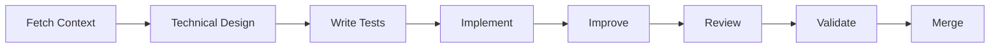

# AI-Assisted Test-Driven Development Starter

A comprehensive, **language-agnostic** starter repository for implementing AI-assisted Test-Driven Development with Claude Code. Fork this to bootstrap any project with a proven TDD workflow that leverages specialized AI agents for each development phase.

This framework adapts to **any programming language or technology stack** - from JavaScript to Rust, from Python to Go. The AI agents understand your project's specific language and apply TDD principles appropriately.

## 🎯 What This Provides

This starter gives you:
- **5 Specialized AI Agents** for the TDD workflow (Coordinator, QA, Developer, Architect, Code Reviewer)
- **Adaptive Project Initialization** that discovers your tech stack and generates appropriate configuration
- **Linear Integration Commands** for managing Epics, Stories, and Subtasks
- **Documentation Templates** for PRD, Architecture, and Contributing guides
- **Language-Agnostic Structure** that adapts to any technology stack

## 🚀 Quick Start

### 1. Fork This Repository
```bash
# Fork on GitHub, then clone
git clone https://github.com/[your-username]/[your-project-name]
cd [your-project-name]
```

### 2. Run Initialization in Claude Code
```
# Open in Claude Code
claude .

# Run the initialization command
> initialize-project
```

The initialization will:
1. **Detect** your existing technology stack and documentation
2. **Interview** you to create missing documentation (PRD, Architecture)
3. **Generate** a customized CLAUDE.md configuration
4. **Setup** project structure and tooling

### 3. Configure Linear (Optional)
If using Linear for issue tracking:
```
# Linear MCP should be installed and configured
# The initializer will help configure team and project IDs
```

## 📁 Repository Structure

```
.
├── .claude/                    # Claude Code configuration
│   ├── agents/                # Specialized TDD agents
│   │   ├── coordinator.md    # Orchestrates workflow
│   │   ├── qa.md            # Writes tests from AC
│   │   ├── developer.md     # Implements code
│   │   ├── architect.md     # Refactors design
│   │   └── code-reviewer.md # Reviews and validates
│   └── commands/             # Workflow commands
│       ├── initialize-project.md
│       ├── generate-claude-md.md
│       ├── create-epic.md
│       ├── create-story.md
│       ├── create-subtasks.md
│       ├── check-overlap.md
│       └── fetch-context.md
├── docs/                      # Documentation
│   ├── templates/            # Interview templates
│   │   ├── prd-interview.md
│   │   └── architecture-interview.md
│   ├── design/              # Design documents
│   │   ├── epics/
│   │   ├── stories/
│   │   └── story-design-template.md
│   ├── adr/                 # Architecture Decision Records
│   │   └── 0000-template.md
│   ├── prd.md              # Product Requirements (template)
│   └── architecture.md     # Architecture Doc (template)
├── src/                      # Source code (your code)
├── tests/                    # Test files (your tests)
├── scripts/                  # Build/deploy scripts
├── config/                   # Configuration files
├── ABOUT.md                 # TDD methodology guide
├── CONTRIBUTING.md          # Development standards
└── CLAUDE.md               # Generated configuration
```

## 🔄 The TDD Workflow

This repository implements a Test-Driven Development workflow:



### Workflow Phases

1. **Context**: Fetch requirements from Linear (Epic → Story → Subtask)
2. **Design**: Create/review technical design (with ADR if needed)
3. **Red**: QA agent writes failing tests from acceptance criteria
4. **Green**: Developer agent implements minimal code to pass
5. **Refactor**: Architect agent improves design keeping tests green
6. **Review**: Code Reviewer agent validates against standards
7. **Validate**: Run CI/CD and verify Definition of Done
8. **Merge**: Complete PR and update Linear

## 🤖 AI Agents

### Coordinator Agent
- Orchestrates the entire TDD workflow
- Never writes code directly
- Gates phase transitions
- Updates Linear status

### QA Agent
- Writes comprehensive tests from acceptance criteria
- Covers edge cases and error conditions
- Maps tests to specific AC items

### Developer Agent
- Implements minimal code to pass tests
- Adds missing tests discovered during implementation
- Keeps changes small and focused

### Architect Agent
- Refactors code while maintaining green tests
- Enforces architectural patterns
- Optimizes performance and security

### Code Reviewer Agent
- Verifies acceptance criteria satisfaction
- Checks security, performance, and maintainability
- Provides pass/fail decision with feedback

## 📋 Linear Integration

### Commands for Linear Workflow

- **`create-epic`**: Generate well-structured epics with minimal overlap
- **`create-story`**: Create stories that reference epics efficiently
- **`create-subtasks`**: Break stories into atomic, hour-sized tasks
- **`check-overlap`**: Remove duplication between hierarchy levels
- **`fetch-context`**: Get full Epic → Story → Subtask context

### Issue Hierarchy
```
Epic (Multi-sprint feature)
└── Story (Single-sprint deliverable)
    └── Subtask (Hours-based implementation)
```

## 🛠 Technology Adaptation

**This framework is truly language-agnostic.** The initialization process automatically detects and adapts to your technology stack, generating appropriate configurations and applying language-specific best practices while maintaining consistent TDD principles.

### Detected Languages
The framework can automatically detect and adapt to:
- **JavaScript/TypeScript**: package.json, tsconfig.json
- **Python**: requirements.txt, setup.py, Pipfile
- **Go**: go.mod, go.sum
- **Java**: pom.xml, build.gradle
- **Rust**: Cargo.toml
- **C#**: *.csproj, *.sln
- **Ruby**: Gemfile
- **PHP**: composer.json
- **And many more...**

**No language preference** - the framework provides the same powerful TDD workflow regardless of your technology choice.

### Generated Configuration
Based on detection, CLAUDE.md will include:
- Correct test commands for your framework
- Appropriate build and lint commands
- Language-specific best practices
- Relevant Definition of Done items

## 📚 Documentation

### Core Documents

- **[ABOUT.md](ABOUT.md)**: Complete TDD methodology and workflow details
- **[CONTRIBUTING.md](CONTRIBUTING.md)**: Development standards and guidelines
- **[docs/prd.md](docs/prd.md)**: Product Requirements template
- **[docs/architecture.md](docs/architecture.md)**: Architecture template

### Generated Documents

After initialization:
- **CLAUDE.md**: Your project-specific configuration
- **Custom PRD**: Based on your interview responses
- **Custom Architecture**: Based on your technical choices

## 🎓 Learning the Workflow

### For Developers
1. Read [ABOUT.md](ABOUT.md) to understand TDD
2. Review agent definitions in `.claude/agents/`
3. Practice with `fetch-context` and the QA agent
4. Follow the Red → Green → Refactor cycle

### For Teams
1. Ensure everyone has Claude Code installed
2. Configure Linear MCP for issue tracking
3. Establish ADR practice for architectural decisions
4. Use the coordinator agent for workflow orchestration

## 🔧 Customization

### Adapting Agents
Edit agent definitions in `.claude/agents/` to match your:
- Coding standards
- Test frameworks
- Review criteria
- Definition of Done

### Adding Commands
Create new commands in `.claude/commands/` for:
- Project-specific workflows
- Integration with other tools
- Custom automation

### Extending Templates
Modify templates in `docs/templates/` to include:
- Industry-specific requirements
- Compliance needs
- Company standards

## 🤝 Contributing

We welcome contributions! See [CONTRIBUTING.md](CONTRIBUTING.md) for:
- Development setup
- Coding standards
- Pull request process
- Testing guidelines

## 📖 References

### Methodology
- [Test-Driven Development](https://en.wikipedia.org/wiki/Test-driven_development)
- [SOLID Principles](https://en.wikipedia.org/wiki/SOLID)
- [Architecture Decision Records](https://adr.github.io/)

### Tools
- [Claude Code](https://claude.ai/code)
- [Linear](https://linear.app)
- [Model Context Protocol](https://modelcontextprotocol.io)

### Related Projects
See [ABOUT.md](ABOUT.md#alternatives-tools-that-can-support-this-workflow) for tools that support similar workflows.

## 📝 License

MIT License - See [LICENSE](LICENSE) for details

## 🚦 Getting Started Checklist

- [ ] Fork this repository
- [ ] Clone to your local machine
- [ ] Open in Claude Code
- [ ] Run `initialize-project`
- [ ] Answer initialization interviews
- [ ] Review generated CLAUDE.md
- [ ] Configure Linear (if using)
- [ ] Create your first Epic/Story
- [ ] Start TDD workflow with coordinator

## 💡 Tips

1. **Always start with context**: Use `fetch-context` before beginning work
2. **Let agents specialize**: Don't have one agent do everything
3. **Maintain documentation**: Keep PRD and Architecture current
4. **Use ADRs**: Document significant decisions
5. **Small PRs**: One story per PR maximum
6. **Update Linear**: Keep issue status current

---

*Ready to implement bulletproof TDD with AI assistance? Fork this repo and run `initialize-project` in Claude Code!*


