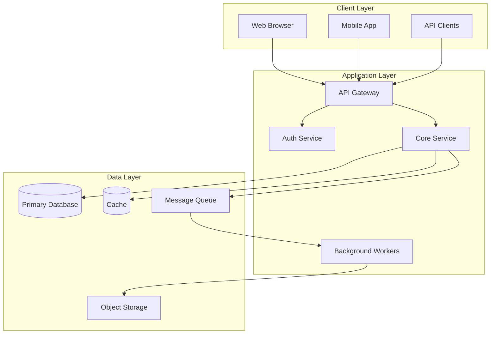
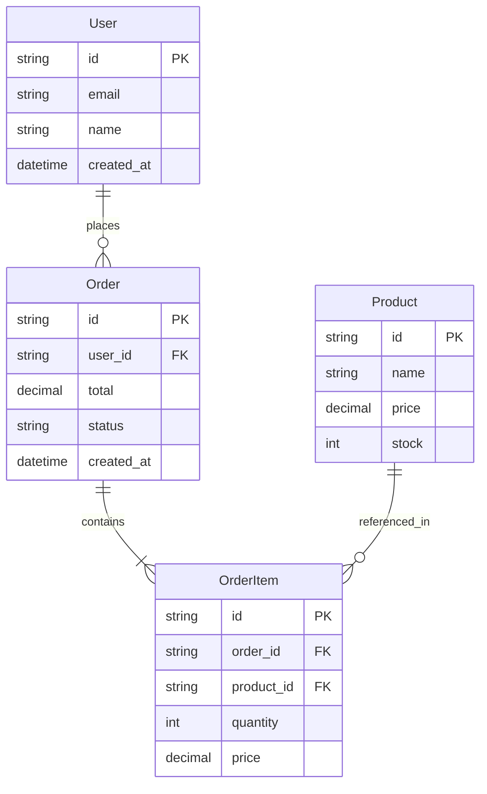
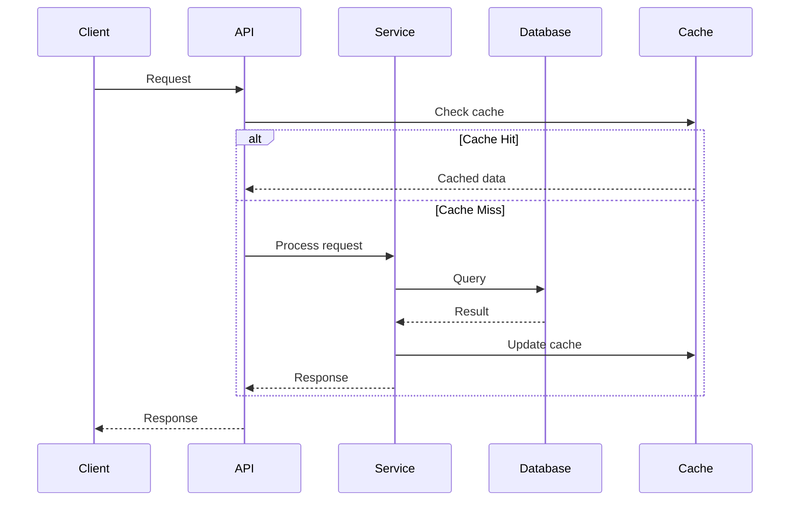
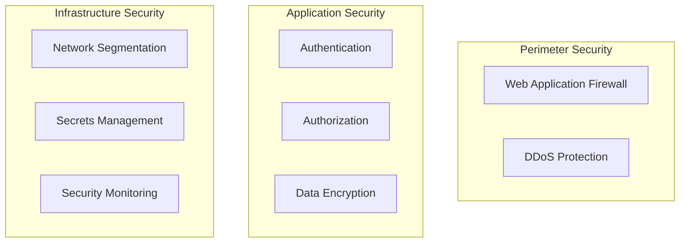
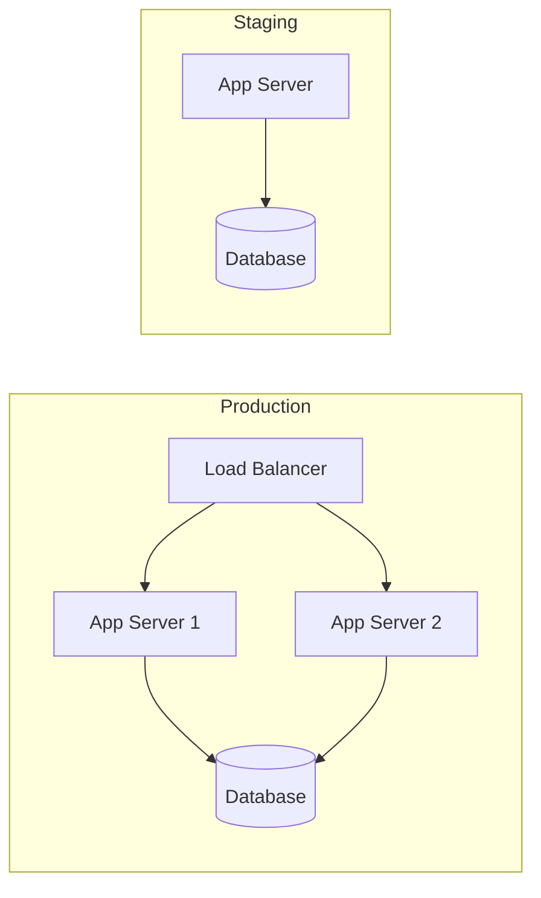
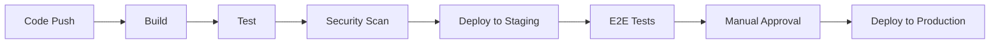
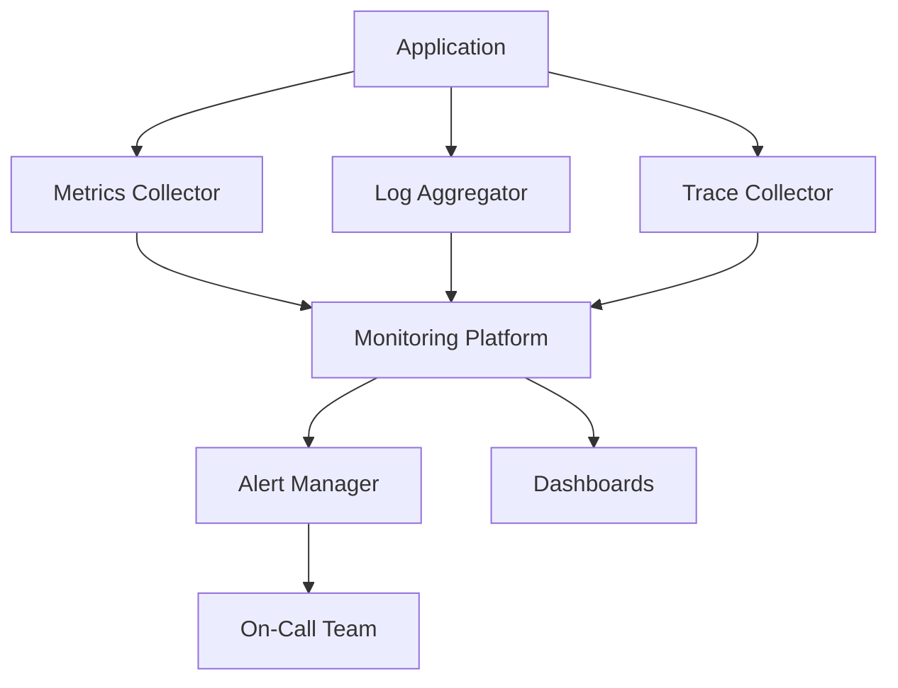

# Architecture Document

> **Note**: This is a template Architecture Document. Run `initialize-project` to generate a customized version based on your project.

## Table of Contents
1. [System Overview](#system-overview)
2. [Architectural Principles](#architectural-principles)
3. [System Architecture](#system-architecture)
4. [Technology Stack](#technology-stack)
5. [Data Architecture](#data-architecture)
6. [Security Architecture](#security-architecture)
7. [Infrastructure & Deployment](#infrastructure--deployment)
8. [Development Practices](#development-practices)
9. [Monitoring & Observability](#monitoring--observability)
10. [Disaster Recovery](#disaster-recovery)

## System Overview

### System Purpose
[Brief description of what the system does and why it exists]

### System Context
[How this system fits into the broader technical and business landscape]

### Key Capabilities
- [Capability 1]
- [Capability 2]
- [Capability 3]

### Architectural Style
**Pattern**: [Monolithic | Microservices | Serverless | Event-Driven | Other]

**Rationale**: [Why this pattern was chosen]

## Architectural Principles

### Design Principles
1. **Principle 1**: [Description and rationale]
2. **Principle 2**: [Description and rationale]
3. **Principle 3**: [Description and rationale]

### Technical Principles
- **Scalability**: [Approach to scaling]
- **Reliability**: [Approach to reliability]
- **Maintainability**: [Approach to maintainability]
- **Security**: [Security-first approach]
- **Performance**: [Performance optimization approach]

### Trade-offs
- **Trade-off 1**: [What we optimize for vs. what we sacrifice]
- **Trade-off 2**: [What we optimize for vs. what we sacrifice]

## System Architecture

### High-Level Architecture



### Component Architecture

#### Component 1: [Name]
- **Purpose**: [What it does]
- **Technology**: [Implementation technology]
- **Responsibilities**:
  - [Responsibility 1]
  - [Responsibility 2]
- **Interfaces**:
  - [Interface 1]
  - [Interface 2]
- **Dependencies**:
  - [Dependency 1]
  - [Dependency 2]

#### Component 2: [Name]
- **Purpose**: [What it does]
- **Technology**: [Implementation technology]
- **Responsibilities**: [List]
- **Interfaces**: [List]
- **Dependencies**: [List]

### API Architecture

#### API Design Standards
- **Style**: [REST | GraphQL | gRPC | Mixed]
- **Versioning**: [Strategy for API versioning]
- **Documentation**: [OpenAPI | GraphQL Schema | Other]

#### API Gateway
- **Purpose**: [Routing, rate limiting, authentication]
- **Features**: [List key features]

#### Service Communication
- **Synchronous**: [HTTP/REST | gRPC | GraphQL]
- **Asynchronous**: [Message Queue | Event Bus | Webhooks]

## Technology Stack

### Core Technologies

| Layer | Technology | Purpose | Rationale |
|-------|------------|---------|-----------|
| Language | [e.g., Python] | Primary development language | [Why chosen] |
| Framework | [e.g., Django] | Web framework | [Why chosen] |
| Database | [e.g., PostgreSQL] | Primary data store | [Why chosen] |
| Cache | [e.g., Redis] | Caching layer | [Why chosen] |
| Queue | [e.g., RabbitMQ] | Message broker | [Why chosen] |

### Development Tools

| Category | Tool | Purpose |
|----------|------|---------|
| Version Control | [e.g., Git] | Source control |
| CI/CD | [e.g., GitHub Actions] | Automation |
| Testing | [e.g., Jest] | Test framework |
| Monitoring | [e.g., Datadog] | Observability |

### Third-Party Services

| Service | Purpose | Integration Method |
|---------|---------|-------------------|
| [Service 1] | [Purpose] | [API/SDK/Webhook] |
| [Service 2] | [Purpose] | [API/SDK/Webhook] |

## Data Architecture

### Data Model



### Data Flow



### Data Storage Strategy

#### Primary Database
- **Type**: [Relational | NoSQL | Graph]
- **Product**: [Specific database]
- **Scaling Strategy**: [Replication | Sharding | Both]
- **Backup Strategy**: [Frequency and method]

#### Caching Strategy
- **Cache Levels**: [Application | Database | CDN]
- **Cache Invalidation**: [TTL | Event-based | Manual]
- **Cache Patterns**: [Cache-aside | Write-through | Write-behind]

#### Data Retention
- **Active Data**: [Retention period]
- **Archived Data**: [Retention period]
- **Compliance Requirements**: [GDPR, etc.]

## Security Architecture

### Security Layers



### Authentication & Authorization

#### Authentication
- **Method**: [JWT | OAuth2 | SAML | Session-based]
- **Provider**: [Internal | Auth0 | Okta | Other]
- **MFA**: [Required | Optional | Not supported]

#### Authorization
- **Model**: [RBAC | ABAC | ACL]
- **Implementation**: [How it's implemented]
- **Permission Levels**: [List of roles/permissions]

### Data Security

#### Encryption
- **At Rest**: [Method and key management]
- **In Transit**: [TLS version and configuration]
- **Key Management**: [How keys are managed]

#### Data Privacy
- **PII Handling**: [How PII is protected]
- **Data Masking**: [When and how data is masked]
- **Audit Logging**: [What is logged and retained]

### Security Controls

- [ ] Input validation
- [ ] Output encoding
- [ ] SQL injection prevention
- [ ] XSS prevention
- [ ] CSRF protection
- [ ] Rate limiting
- [ ] Security headers
- [ ] Dependency scanning
- [ ] Secret scanning
- [ ] SAST/DAST

## Infrastructure & Deployment

### Deployment Architecture



### Infrastructure Components

#### Compute
- **Platform**: [AWS EC2 | Azure VMs | GCP Compute | Kubernetes]
- **Scaling**: [Auto-scaling configuration]
- **Instance Types**: [Specifications]

#### Networking
- **Load Balancing**: [Type and configuration]
- **CDN**: [Provider and configuration]
- **DNS**: [Provider and configuration]

#### Storage
- **Object Storage**: [S3 | Azure Blob | GCS]
- **Block Storage**: [EBS | Azure Disk | Persistent Disk]
- **Backup Storage**: [Backup solution]

### Deployment Strategy

#### CI/CD Pipeline



#### Deployment Process
- **Strategy**: [Blue-Green | Canary | Rolling]
- **Rollback**: [Rollback procedure]
- **Feature Flags**: [How they're used]

## Development Practices

### Code Organization

```
project/
├── src/
│   ├── api/          # API endpoints
│   ├── services/     # Business logic
│   ├── models/       # Data models
│   ├── utils/        # Utilities
│   └── config/       # Configuration
├── tests/
│   ├── unit/         # Unit tests
│   ├── integration/  # Integration tests
│   └── e2e/         # End-to-end tests
├── docs/            # Documentation
├── scripts/         # Build/deploy scripts
└── config/          # Configuration files
```

### Development Workflow

#### Branching Strategy
- **Model**: [Git Flow | GitHub Flow | Trunk-based]
- **Branch Naming**: [Convention]
- **Merge Strategy**: [Squash | Merge commit | Rebase]

#### Code Review
- **Required Approvals**: [Number]
- **Review Checklist**: [Key items]
- **Automated Checks**: [Linting, tests, etc.]

### Testing Strategy

#### Test Pyramid
```
        /\
       /E2E\
      /------\
     /Integr. \
    /----------\
   /   Unit     \
  /--------------\
```

#### Test Coverage
- **Unit Tests**: [Target coverage %]
- **Integration Tests**: [Scope]
- **E2E Tests**: [Critical paths]
- **Performance Tests**: [Frequency and scope]

## Monitoring & Observability

### Observability Stack



### Metrics & KPIs

#### System Metrics
- **Availability**: [Target and measurement]
- **Latency**: [p50, p95, p99 targets]
- **Error Rate**: [Acceptable threshold]
- **Throughput**: [Expected RPS]

#### Business Metrics
- [Metric 1]: [Description and target]
- [Metric 2]: [Description and target]

### Logging

#### Log Levels
- **ERROR**: [When to use]
- **WARN**: [When to use]
- **INFO**: [When to use]
- **DEBUG**: [When to use]

#### Log Aggregation
- **Platform**: [ELK | Splunk | CloudWatch | Other]
- **Retention**: [Period]
- **Sampling**: [Strategy if applicable]

### Alerting

#### Alert Categories
- **Critical**: [Examples and response time]
- **Warning**: [Examples and response time]
- **Info**: [Examples]

#### Escalation
1. **Level 1**: [Who and when]
2. **Level 2**: [Who and when]
3. **Level 3**: [Who and when]

## Disaster Recovery

### Backup Strategy

#### Data Backups
- **Frequency**: [How often]
- **Retention**: [How long]
- **Testing**: [How often tested]
- **Storage**: [Where stored]

### Recovery Procedures

#### RTO and RPO
- **RTO** (Recovery Time Objective): [Target time]
- **RPO** (Recovery Point Objective): [Maximum data loss]

#### Disaster Scenarios

| Scenario | Impact | Recovery Procedure | RTO |
|----------|--------|-------------------|-----|
| Database failure | High | Failover to replica | 5 min |
| Region outage | Critical | Multi-region failover | 30 min |
| Data corruption | High | Restore from backup | 2 hours |

## Performance Requirements

### Performance Targets

| Metric | Target | Current | Notes |
|--------|--------|---------|-------|
| Response Time (p95) | < 200ms | - | API responses |
| Throughput | 1000 RPS | - | Peak load |
| Concurrent Users | 10,000 | - | Simultaneous |
| Database Queries | < 50ms | - | p95 |

### Performance Optimization

#### Strategies
- **Caching**: [What and where]
- **Database Optimization**: [Indexes, query optimization]
- **Code Optimization**: [Hot path optimization]
- **CDN Usage**: [Static content delivery]

## Compliance & Governance

### Regulatory Compliance
- [ ] GDPR
- [ ] CCPA
- [ ] HIPAA
- [ ] SOC 2
- [ ] PCI DSS

### Data Governance
- **Data Classification**: [Public | Internal | Confidential | Restricted]
- **Data Ownership**: [Who owns what data]
- **Access Controls**: [How access is managed]

## Architecture Decision Records

### ADR-001: [Decision Title]
- **Status**: [Proposed | Accepted | Deprecated]
- **Context**: [Why this decision was needed]
- **Decision**: [What was decided]
- **Consequences**: [Impact of the decision]

### ADR-002: [Decision Title]
- **Status**: [Status]
- **Context**: [Context]
- **Decision**: [Decision]
- **Consequences**: [Consequences]

## Appendices

### A. Glossary
| Term | Definition |
|------|------------|
| [Term 1] | [Definition] |
| [Term 2] | [Definition] |

### B. References
- [Architecture patterns reference]
- [Technology documentation links]
- [Internal documentation links]

### C. Diagrams
- [Links to additional diagrams]
- [Draw.io or other diagram sources]

### D. Configuration Examples
- [Sample configuration files]
- [Environment variable templates]

---

*Document Version*: 1.0
*Last Updated*: [Date]
*Status*: Draft | Review | Approved
*Next Review*: [Date]